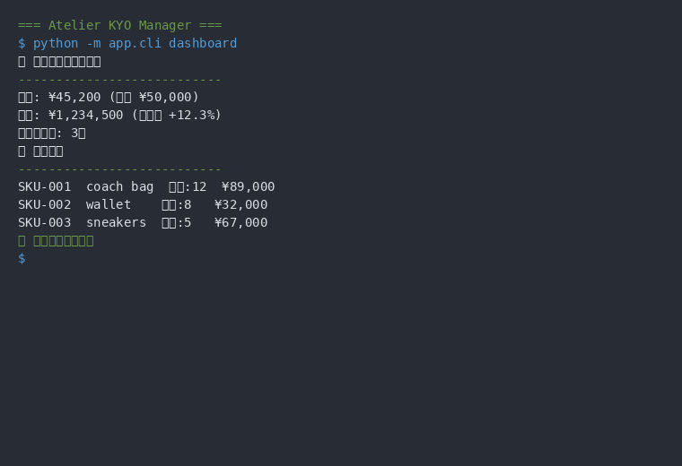
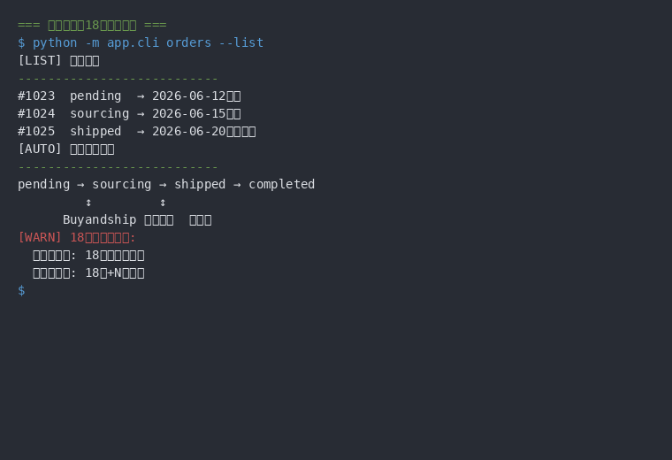
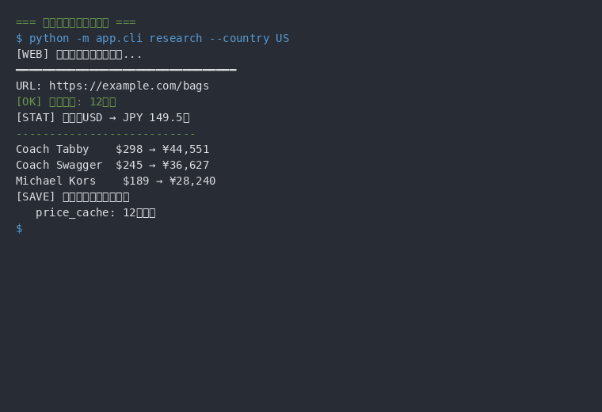
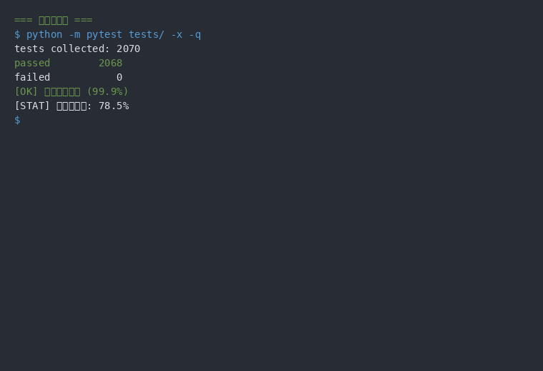
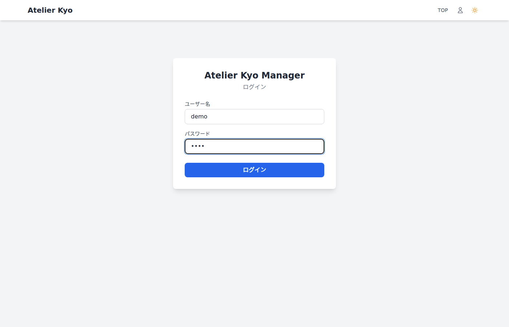
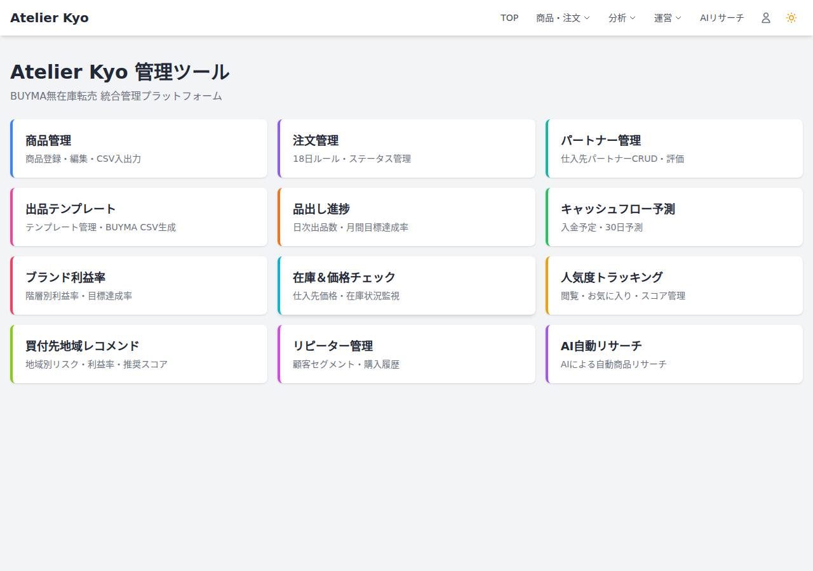
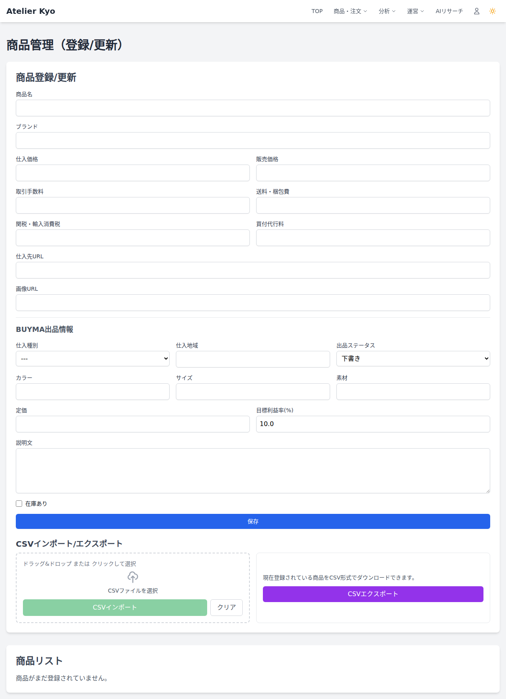
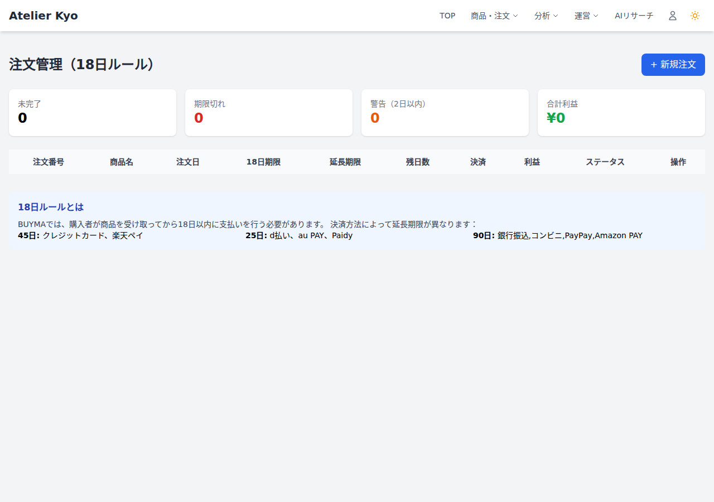

# atelier-kyo-manager

A personal resale management system for BUYMA x Buyandship. Automates product listing pipelines, order state machines, and customer support with an AI chatbot and multi-provider LLM routing.

BUYMA x Buyandshipを利用した転売管理システム（個人用）。出品パイプライン、注文ステートマシン、顧客対応AIチャットボット、LLMルーティングを統合したFlaskアプリケーション。

[](https://www.python.org/)
[]()
[](LICENSE)

---

## スクリーンショット

### CLI デモ（GIF）

<table>
  <tr>
    <td align="center"><b>ダッシュボード</b></td>
    <td align="center"><b>注文ステートマシン</b></td>
  </tr>
  <tr>
    <td></td>
    <td></td>
  </tr>
  <tr>
    <td>売上概要・商品一覧・システム状態</td>
    <td>18日ルールの注文状態遷移</td>
  </tr>
  <tr>
    <td align="center"><b>価格スクレイピング</b></td>
    <td align="center"><b>テストスイート</b></td>
  </tr>
  <tr>
    <td></td>
    <td></td>
  </tr>
  <tr>
    <td>Playwrightで海外サイト価格自動取得</td>
    <td>2,155テスト（カバレッジはCI完全緑化後に再計測）</td>
  </tr>
</table>

### 操作デモ（GIF）

<p align="center">
  
</p>

> ログイン → ダッシュボード → 商品管理 → 注文管理 → キャッシュフローの流れ。

<table>
  <tr>
    <td align="center"><b>ダッシュボード</b></td>
    <td align="center"><b>商品管理</b></td>
    <td align="center"><b>注文管理</b></td>
  </tr>
  <tr>
    <td></td>
    <td></td>
    <td></td>
  </tr>
</table>

> 🔥 **[機能ショーケース（GitHub Pages）](https://fukukei23.github.io/atelier-kyo-manager/)** — 全画面のスクリーンショット・GIF・操作説明を網羅

---

## 特徴

- **出品パイプライン自動化**: 画像収集 → AI背景除去 → AI説明文生成 → 出品テキスト生成を一括実行
- **注文ステートマシン**: 自動発注の状態遷移（pending → sourcing → shipped → completed）を管理
- **AIチャットボット**: FAQテンプレートマッチ → AI回答生成 → エスカレーション判定の3段階分類
- **LLMルーティング**: OpenAI / Gemini / Local LLMを統一的に管理、ディスクキャッシュ付き
- **価格スクレイピング**: Playwrightヘッドレスブラウザで仕入先価格を自動取得
- **18日ルール管理**: 決済方法別の延長期限マッピングとBUYMA手数料計算

---

## なぜ作ったか

BUYMAでの転売業務は、出品・価格調整・発注・顧客対応など多岐にわたる手作業が発生する。これらをFlask Webアプリ + AI/LLMで自動化し、1人でもスケール可能な物販システムを目指して開発した。

---

## アーキテクチャ

Flask App Factoryパターン（`create_app`）によるアプリケーション初期化。

```
Flask App Factory (create_app)
  ├── Blueprint (6モジュール)    ← HTTPルーティング
  │     analytics / orders / partners / products / misc / warehouse_webhook
  ├── Service層 (8モジュール)    ← ビジネスロジック
  │     auto_order / chatbot / image / notification / pipeline / price_scraper / template / warehouse_event
  ├── Models (16種)              ← SQLAlchemyデータモデル
  ├── Utils (20+モジュール)      ← ai_llm_controller / fx_utils / pricing_calculator 等
  └── Templates / Static         ← Jinja2 + CSS/JS
```

**データフロー**: HTTPリクエスト → Blueprint → Service層 → Model/外部API → Response

---

## 技術スタック

| カテゴリ | 技術 |
|---|---|
| 言語 | Python 3.x |
| フレームワーク | Flask + SQLAlchemy + Flask-Login + Flask-WTF |
| データベース | SQLite (Flask-Migrate) |
| スクレイピング | Playwright / Selenium |
| 画像処理 | Pillow / OpenCV / rembg |
| LLM | OpenAI API / Gemini API / Local LLM |
| テスト | pytest (2,155 tests) |

---

## セットアップ（WSL2前提）

```bash
git clone https://github.com/fukukei23/atelier-kyo-manager.git
cd atelier-kyo-manager
make venv              # venv作成
make install           # 依存インストール
cp .env.template .env  # .envを編集
flask db upgrade       # DBマイグレーション
flask run              # 開発サーバー起動
```

`Makefile.local` でプロジェクト固有のターゲットを拡張可能。

---

## 主要コマンド

| コマンド | 説明 |
|---|---|
| `make venv` | venv作成 |
| `make install` | 依存インストール |
| `make install-dev` | 開発用依存も含めてインストール |
| `make test` | pytest実行 |
| `make lint` | ruff / flake8実行 |
| `make format` | black実行（導入時） |
| `make clean-pyc` | `__pycache__`削除 |
| `make info` | Python / pip / プロジェクト情報表示 |
| `flask run` | 開発サーバー起動 |

---

## プロジェクト状況

| 指標 | 値 |
|------|-----|
| テスト数 | 2,155 テストケース（pytest） |
| モジュール数 | routes 14 + services 8 + models 16 + utils 20+ |
| LLMプロバイダー | OpenAI / Gemini / Local LLM |
| データベース | SQLite + Flask-Migrate |

---

## テスト

```bash
# テスト実行
make test

# カバレッジ付き
./venv/bin/python -m pytest tests/ --cov=app --cov-report=term-missing -q
```

---

## ディレクトリ構造

```
app/
  __init__.py              # Flask app factory (create_app)
  auth.py                  # 認証Blueprint
  config/                  # 設定モジュール
  models/                  # SQLAlchemyモデル (16種)
    product.py             #   商品（価格計算・BUYMA連携）
    order.py               #   注文（18日ルール・利益計算）
    user.py                #   ユーザー認証
    partner.py             #   パートナー管理
    customer_inquiry.py    #   顧客問い合わせ（AIチャットボット）
    faq_template.py        #   FAQテンプレート
    listing_progress.py    #   出品進捗
    listing_template.py    #   出品テンプレート
    popularity_tracker.py  #   人気追踪
    prohibited_source.py   #   禁止ソース
    region_recommendation.py # 地域レコメンド
    repeat_customer.py     #   リピーター顧客
    shipment_notification.py # 出荷通知
    stock_check.py         #   在庫・価格チェック
  routes/                  # Blueprint ルート (6モジュール)
    analytics.py           #   分析ダッシュボード・API
    orders.py              #   注文管理・キャッシュフロー
    partners.py            #   パートナー・リピーター顧客
    products.py            #   商品CRUD・パイプライン・CSV
    misc.py                #   リダイレクト・倉庫API
    warehouse_webhook.py   #   倉庫Webhook受信
  services/                # ビジネスロジック (8モジュール)
    auto_order_service.py  #   自動発注ステートマシン
    chatbot_service.py     #   AIチャットボット
    image_service.py       #   画像処理
    notification_service.py #  Slack通知
    pipeline_service.py    #   出品パイプライン
    price_scraper.py       #   価格スクレイピング
    template_service.py    #   テンプレート生成
    warehouse_event_service.py # 倉庫イベント処理
  utils/                   # ユーティリティ (20+モジュール)
    ai_llm_controller.py   #   LLMルーティング
    fx_utils.py            #   為替計算
    pricing_calculator.py  #   価格計算
  templates/               # Jinja2テンプレート
  static/                  # 静的ファイル
tests/                     # pytestテスト
docs/                      # ドキュメント
config/                    # 設定ファイル
migrations/                # DBマイグレーション
```

---

## 環境変数（主要）

| 変数 | 説明 |
|---|---|
| `FLASK_APP` | Flaskアプリエントリポイント |
| `BUYANDSHIP_EMAIL` | Buyandshipログイン用 |
| `OPENAI_API_KEY` | OpenAI APIキー |
| `GEMINI_API_KEY` | Gemini APIキー |
| `LLM_ORDER_DEFAULT` | デフォルトLLMプロバイダー |
| `CRAWLER_HEADLESS` | ヘッドレスブラウザ設定 |

---

## ドキュメント

| ドキュメント | 内容 |
|---|---|
| [機能ショーケース](https://fukukei23.github.io/atelier-kyo-manager/) | 全画面のスクリーンショット・GIF・操作説明 |
| [開発ガイド](docs/) | 詳細ドキュメント |
| [仕様書・設計判断](https://github.com/fukukei23/obsidian-ssot/tree/main/01_DECISIONS/atelier-kyo-manager) | 設計判断の変遷（SSOT） |
| [リファクタリングバックログ](docs/リファクタリングバックログ.md) | 改善項目の進捗管理 |

---

## ライセンス

MIT License — 詳細は [LICENSE](LICENSE) を参照。
