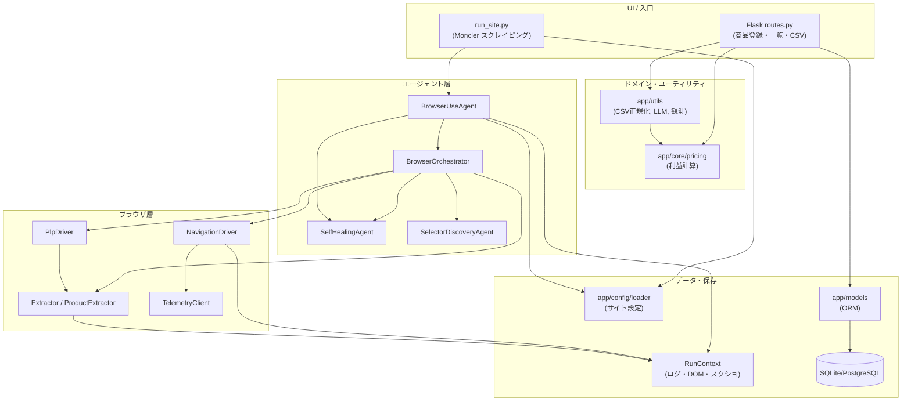
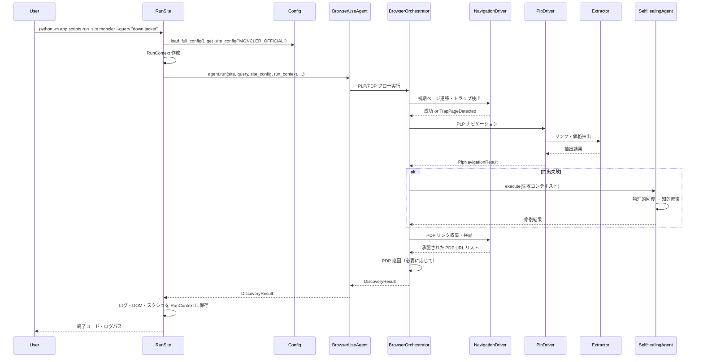
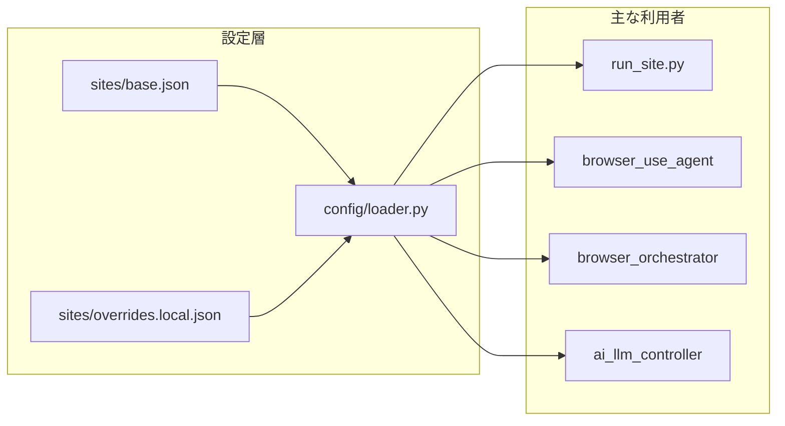

# Atelier Kyo Manager：主要コンポーネント・データフロー・学習ルート

本ドキュメントは、プロジェクトの**主要コンポーネントの詳細説明**、**具体的なデータフロー図**、**どのファイルをどの順で読むとよいか（学習ルート）** をまとめたものです。新規参加者やコードベース理解用のガイドとして利用してください。

---

## 1. 主要コンポーネントの詳細説明

### 1.1 全体の層構成（どこに何があるか）

| 層 | ディレクトリ | 役割（一言） |
|----|--------------|--------------|
| **Web/ルーティング** | `app/routes.py` | HTTP 受付のみ。ロジックは持たず、utils/agents に委譲。 |
| **ドメイン/コア** | `app/core/` | BUYMA のビジネスルール（価格計算など）の正本。 |
| **ユーティリティ** | `app/utils/` | CSV 正規化・LLM 呼び出し・観測用保存など。Flask に依存しない。 |
| **エージェント** | `app/agents/` | ブラウザ操作・自己修復・セレクタ発見など「外部に依存する処理」の入口。 |
| **ブラウザ層** | `app/agents/browser/` | ナビゲーション・抽出・セッション・テレメトリの中核。 |
| **設定** | `app/config/` | サイト別設定・LLM コストなど。全コンポーネントが参照。 |
| **データ** | `app/models/` | ORM（SQLAlchemy）のモデル定義。 |

---

### 1.2 コア層（app/core/）

- **役割**  
  BUYMA ドメインの「正本」となるロジックを置く場所。Web やスクレイピングに依存しない純粋な計算・ルール。

- **主要ファイル**
  - **`app/core/pricing/calculator.py`**  
    利益計算の唯一の入口。`PricingInput`（仕入価格・販売価格・送料・関税など）を受け取り、`PricingResult`（利益・利益率など）を返す。BUYMA 手数料率は `rules` から読み込む。
  - **`app/core/pricing/rules.py`**  
    価格計算用の設定（手数料率など）を読み込む。
  - **`app/core/pricing/schemas.py`**  
    `PricingInput` / `PricingResult` の型定義。

- **補足**  
  実行コンテキスト（ログ保存パス・run_id など）は `RunContext` として `app.core.run_context` から提供され、スクレイピング系のエージェント全体で共有されます。

---

### 1.3 設定層（app/config/）

- **役割**  
  サイト別設定・タイムアウト・発見設定などを一元管理。**多くのモジュールがここに依存**するため、変更時の影響が大きい。

- **主要ファイル**
  - **`app/config/loader.py`**  
    設定読み込みの**唯一の公式インターフェース**。`base.json` と `overrides.local.json` を深くマージし、`load_full_config()` / `get_site_config(site_name)` で取得。
  - **`app/config/sites/base.json`**  
    全サイト共通のベース設定。
  - **`app/config/sites/overrides.local.json`**  
    ローカル／サイト別の上書き（Moncler 用など）。リポジトリに含めない運用も可。

- **データの流れ**  
  `load_full_config()` → 各エージェント・`run_site` が `get_site_config("MONCLER_OFFICIAL")` などでサイト単位の設定を取得。

---

### 1.4 ユーティリティ層（app/utils/）

- **役割**  
  価格計算以外の「ドメイン寄りの処理」と、LLM・ファイル保存・観測用の共通処理。Flask に依存しない設計。

- **主要ファイル（抜粋）**
  - **`app/utils/ai_llm_controller.py`**  
    LLM 呼び出しの統一入口。OpenAI / Claude / ローカルモデルなどに対応。多くのエージェント（selector_repair, failure_analysis, profitability など）が利用。
  - **`app/utils/sourcing_csv_adapter.py`**  
    CSV 行を正規化（空欄・N/A を "unknown" に、数値はカンマ対応でパース）。**downstream のロジックは知らない**。
  - **`app/utils/sourcing_input_schema.py`**  
    必須項目・型・範囲チェックと、unknown を考慮した partial/complete 判定。ビジネスルールの入口。
  - **`app/utils/sourcing_csv_batch_runner.py`**  
    CSV を 1 行ずつ処理し、invalid 行を下流に流さない。I/O と Fail-Fast / Fail-Soft の制御。
  - **`app/utils/observability.py`**  
    DOM 保存・セレクタ数保存・失敗スナップショットなど。Telemetry と併用され、RunContext のパスに保存。

---

### 1.5 エージェント層（app/agents/）— 概要

- **役割**  
  ブラウザ操作・セレクタ発見・自己修復・利益計算の「現場」を担当。LLM や Playwright に依存する処理はここに集約。

- **入口となるスクリプト**  
  **`app/scripts/run_site.py`**  
  - 例: `python -m app.scripts.run_site moncler --query "down jacket"`  
  - サイトエイリアス（`moncler` → `MONCLER_OFFICIAL`）を解決し、設定を読み、`RunContext` を組み立て、`BrowserUseAgent.run()` を呼び出す。

---

### 1.6 ブラウザユースエージェント（BrowserUseAgent）

- **ファイル**  
  **`app/agents/browser_use_agent.py`**

- **役割**  
  - スクレイピング実行の**最上位の入口**。  
  - サイト設定・クエリ・URL を受け取り、PLP（一覧）→ PDP（商品詳細）の流れを実行。  
  - 内部で `BrowserOrchestrator`、`NavigationDriver`、`PlpDriver`、`SelectorDiscoveryAgent`、`SelfHealingAgent` などを利用。

- **主な流れ（概念）**  
  1. 設定・RunContext を受け取る。  
  2. PLP へナビゲートし、トラップページ検出・ロケール制御を行う。  
  3. PDP リンクを収集し、必要に応じて PDP を巡回。  
  4. 失敗時は Self-Healing（物理的回復・知的修復）を試行。  
  5. 結果を `DiscoveryResult` として返す。

- **注意**  
  ファイルが非常に大きく、責務が集中しているため、将来的な分割（ナビゲーション・抽出・UI ヘルパーなど）が検討されています。

---

### 1.7 ブラウザオーケストレータ（BrowserOrchestrator）

- **ファイル**  
  **`app/agents/browser_orchestrator.py`**

- **役割**  
  - `BrowserUseAgent` の PLP/PDP フローを**統括**するオーケストレータ。  
  - NavigationDriver / PlpDriver / Extractor / SelectorDiscoveryAgent / FailureAnalysisAgent / SelfHealingPatchAgent などを組み合わせ、状態遷移とエラー処理を一元管理。  
  - 現状は BrowserUseAgent と併用され、段階的に責務が移行されている。

---

### 1.8 ブラウザ下位層（app/agents/browser/）

| ファイル | 役割 |
|----------|------|
| **navigation_driver.py** | ページ遷移・トラップ検出・PDP リンク収集・ロケール判定。多くのコンポーネントから参照される。 |
| **plp_driver.py** | PLP のナビゲーション結果（PlpNavigationResult）を返す。NavigationDriver と連携。 |
| **extractor.py** | DOM から商品リンク・価格などの抽出。`looks_like_product_url` など URL 判定も提供。 |
| **product_extractor.py** | PDP 用の商品情報抽出。 |
| **session_manager.py** | ブラウザセッションの作成・管理。RunContext と連携。 |
| **telemetry.py** | TelemetryClient / TelemetryService。PLP 状態の記録・DOM/JSON/スクリーンショット保存。 |
| **ui_helpers.py** | クッキー同意・モーダル閉じなど、UI まわりのヘルパー。 |
| **settings.py** | ブラウザ用設定の保持。 |

---

### 1.9 自己修復まわり（Self-Healing）

- **`app/agents/self_healing_agent.py`**  
  - 現場指揮官。失敗時に「物理的回復」（PageRecoveryAgent）と「知的修復」（SelectorRepairAgent の代替セレクタ提案）を順に試行。

- **`app/agents/page_recovery_agent.py`**  
  - 再読み込み・スクロール・待機など、ページの物理的な復旧を試みる。

- **`app/agents/selector_repair_agent.py`**  
  - 失敗したセレクタと HTML を元に、LLM で代替セレクタを提案。RunContext を利用してログ・提案を保存。

- **`app/agents/selector_discovery_agent.py`**  
  - セレクタの「発見」を担当。BrowserUseAgent から呼ばれ、発見結果を返す。

- **`app/agents/failure_analysis_agent.py`**  
  - 失敗原因の分析。オーケストレータや Self-Healing の判断材料として利用。

- **`app/agents/self_healing_patch_agent.py`** / **self_healing_patch_applier.py**  
  - パッチの提案と適用。Moncler 向けのサイト別修正などに利用。

---

### 1.10 Moncler 専用まわり

- **`app/agents/moncler/moncler_plp_handler.py`**  
  Moncler の PLP 用ナビゲーション・抽出ポリシー。

- **`app/agents/moncler/moncler_pdp_handler.py`**  
  Moncler の PDP 用抽出・URL 正規化。

- **`app/agents/browser/moncler_patch.py`**  
  ブラウザ操作まわりの Moncler 用パッチ。

---

### 1.11 その他のエージェント（参考）

- **profitability_agent.py** … 利益計算・採算判定。  
- **supplier_scout_agent.py** … 仕入先スカウト。  
- **price_intelligence_agent.py** … 価格情報の取得・分析。  
- **reporting_agent.py** … レポート生成。  

これらは LLM や外部データに依存する「エージェント」として、utils や core の計算結果を組み合わせて利用します。

---

## 2. 具体的なデータフロー図

### 2.1 アプリ全体の論理フロー（ユーザー操作 → 保存）

- **要点**  
  - Web は「ロジックを持たず」core / utils / models に委譲。  
  - スクレイピングは `run_site` → BrowserUseAgent → Orchestrator → NavigationDriver / PlpDriver / Extractor。  
  - 設定は Config、実行ごとの成果物は RunContext に集約。

---

### 2.2 スクレイピング 1 回の流れ（PLP → PDP → 結果）

- **要点**  
  - 設定と RunContext を用意したうえで、BrowserUseAgent が Orchestrator 経由で NavigationDriver / PlpDriver / Extractor を動かす。  
  - 失敗時は SelfHealingAgent が物理的・知的修復を試み、結果は RunContext 配下に残る。

---

### 2.3 設定とコンポーネントの依存関係（簡略）

- **要点**  
  設定は **loader のみ** が読み、他は `load_full_config()` / `get_site_config()` で参照する。

---

## 3. 学習ルート（どのファイルをどの順で読むか）

初めてコードを読む人向けに、「全体像 → 設定 → コア → スクレイピングの入口 → ブラウザ層 → 自己修復」の順を推奨します。

---

### フェーズ 1：全体像とルール（30 分程度）

| 順番 | ファイル | 目的 |
|------|----------|------|
| 1 | [README.md](../../README.md)（プロジェクトルート） | プロジェクトの目的・機能・実行方法の把握。 |
| 2 | [docs/00_governance/ARCHITECTURE.md](../00_governance/ARCHITECTURE.md) | 責務境界・データフロー・ディレクトリの「正本」の理解。 |
| 3 | [.cursorrules](../../.cursorrules)（ルート） | 編集してよい領域・禁止領域の確認。 |

---

### フェーズ 2：設定とコア（30 分程度）

| 順番 | ファイル | 目的 |
|------|----------|------|
| 4 | [app/config/loader.py](../../app/config/loader.py) | 設定がどう読み込まれ、どこに渡るかの把握。 |
| 5 | [app/config/sites/base.json](../../app/config/sites/base.json) | サイト共通設定の構造の把握。 |
| 6 | [app/core/pricing/schemas.py](../../app/core/pricing/schemas.py) | 価格計算の入出力型の把握。 |
| 7 | [app/core/pricing/calculator.py](../../app/core/pricing/calculator.py) | 利益計算の正本ロジックの把握。 |

---

### フェーズ 3：スクレイピングの入口（45 分程度）

| 順番 | ファイル | 目的 |
|------|----------|------|
| 8 | [app/scripts/run_site.py](../../app/scripts/run_site.py) | コマンドラインから RunContext 作成・BrowserUseAgent 起動までの流れ。 |
| 9 | [app/agents/browser_use_agent.py](../../app/agents/browser_use_agent.py) | `run()` のシグネチャと、Orchestrator / SelfHealing の呼び出し箇所だけ追う（全体通読は後回しで可）。 |
| 10 | [app/agents/browser_orchestrator.py](../../app/agents/browser_orchestrator.py) | クラス概要と、PLP/PDP をどう順に実行しているかの把握。 |

---

### フェーズ 4：ブラウザ層（1 時間程度）

| 順番 | ファイル | 目的 |
|------|----------|------|
| 11 | [app/agents/browser/session_manager.py](../../app/agents/browser/session_manager.py) | ブラウザセッションと RunContext の関係。 |
| 12 | [app/agents/browser/navigation_driver.py](../../app/agents/browser/navigation_driver.py) | ナビゲーション・トラップ検出・PDP リンク収集の「入口」メソッドだけでもよい。 |
| 13 | [app/agents/browser/plp_driver.py](../../app/agents/browser/plp_driver.py) | PLP 結果の型（PlpNavigationResult）と NavigationDriver との連携。 |
| 14 | [app/agents/browser/extractor.py](../../app/agents/browser/extractor.py) | 抽出関数と `looks_like_product_url` の役割。 |
| 15 | [app/agents/browser/telemetry.py](../../app/agents/browser/telemetry.py) | TelemetryClient が何を保存するかの把握。 |

---

### フェーズ 5：自己修復と周辺（45 分程度）

| 順番 | ファイル | 目的 |
|------|----------|------|
| 16 | [app/agents/self_healing_agent.py](../../app/agents/self_healing_agent.py) | 物理的回復 → 知的修復の順と、PageRecovery / SelectorRepair の役割。 |
| 17 | [app/agents/selector_repair_agent.py](../../app/agents/selector_repair_agent.py) | 代替セレクタ提案の流れと RunContext の利用。 |
| 18 | [app/agents/selector_discovery_agent.py](../../app/agents/selector_discovery_agent.py) | セレクタ発見が BrowserUseAgent からどう呼ばれるか。 |

---

### フェーズ 6：Web とデータ（必要に応じて）

| 順番 | ファイル | 目的 |
|------|----------|------|
| 19 | [app/routes.py](../../app/routes.py) | ルートが core/utils/models にどう委譲しているか（編集は禁止だが理解は推奨）。 |
| 20 | [app/utils/sourcing_csv_adapter.py](../../app/utils/sourcing_csv_adapter.py) | CSV 正規化の責務範囲（downstream を知らない）。 |
| 21 | [app/utils/ai_llm_controller.py](../../app/utils/ai_llm_controller.py) | LLM 呼び出しの統一インターフェース。 |

---

### 学習ルートの図（簡略）

```mermaid
flowchart LR
    subgraph Phase1["フェーズ1"]
        R[README]
        A[ARCHITECTURE]
        C[.cursorrules]
    end

    subgraph Phase2["フェーズ2"]
        L[config/loader]
        S[core/pricing]
    end

    subgraph Phase3["フェーズ3"]
        RS[run_site]
        BUA[BrowserUseAgent]
        Orch[BrowserOrchestrator]
    end

    subgraph Phase4["フェーズ4"]
        SM[session_manager]
        Nav[navigation_driver]
        Plp[plp_driver]
        Ext[extractor]
        Tel[telemetry]
    end

    subgraph Phase5["フェーズ5"]
        SH[self_healing_agent]
        SR[selector_repair]
        SD[selector_discovery]
    end

    Phase1 --> Phase2 --> Phase3 --> Phase4 --> Phase5
```

---

## 4. 参照ドキュメント一覧

- [README.md](../../README.md)（プロジェクトルート）… プロジェクト概要・セットアップ・実行方法  
- [docs/00_governance/ARCHITECTURE.md](../00_governance/ARCHITECTURE.md) … 構成・責務の正本  
- [docs/official/system_design.md](system_design.md) … システム仕様・非機能要件  
- [docs/official/architecture_overview.mmd](architecture_overview.mmd) … レイヤー図（Mermaid）  
- [docs/README.md](../README.md) … ドキュメント構成・レポート置き場  

---

**更新目安**  
コンポーネントの追加・責務の移動・データフローの変更があった場合は、本ドキュメントと上記参照ドキュメントをあわせて更新してください。
